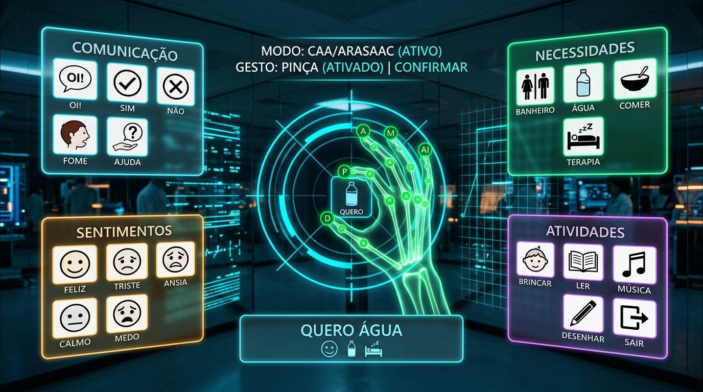

# ✦ CETAM LAB TEA ✦
### Interface Holográfica Touchless com Visão Computacional para Apoio a Pessoas no Espectro Autista

> **Projeto MVP desenvolvido para o Curso Técnico em Manutenção e Suporte em Informática - CETAM**  
> *CETAM - Centro de Educação Tecnológica do Amazonas* | *IBC - Instituto Benjamin Constant*  
> Interface espacial nos 4 quadrantes para acessibilidade motora e cognitiva (*Barehands* / MediaPipe / ARASAAC CAA).

---



---

## 🌟 Visão Geral do Projeto

O **CETAM LAB TEA** é um ambiente de tecnologia assistiva sem toque (*Touchless*) projetado para apoiar profissionais de educação especial, psicólogos e mediadores no acolhimento de pessoas com Transtorno do Espectro Autista (TEA) e outras neurodivergências.

A aplicação captura a imagem da webcam e a exibe em **tela cheia em modo espelho (Realidade Aumentada)**, projetando **4 Decks Holográficos nos 4 cantos da tela**, permitindo comunicação autônoma no ar através do movimento natural das mãos:

* 🧘 **Canto Superior Esquerdo (Sensorial & Conforto):** Manifestação de sobrecarga sonora, iluminação, necessidade de pausa ou conforto no ambiente.
* 💧 **Canto Inferior Esquerdo (Necessidades Básicas):** Água, banheiro, alimentação e pedido de apoio.
* ⚡ **Canto Superior Direito (Expressão Rápida):** Sim, não, solicitação para repetir ou aguardar.
* 🌀 **Canto Inferior Direito (Calmaria & Apoio):** Exercício visual de respiração guiada (técnica 4-4-4), ajuda imediata e feedback positivo.
* 🎯 **Centro da Tela:** Visor livre para reflexo do estudante, mira holográfica reativa e telemetria espacial em tempo real.

---

## 🌐 100% Autônomo e Pronto para Operação Offline (Rede Local / Intranet)

Um dos pilares arquiteturais do projeto é o **funcionamento pleno sem acesso à internet**:
* **MediaPipe Hands Local:** Scripts JavaScript, binários WebAssembly (`.wasm`) e modelos neurais TFLite (`hand_landmark_full.tflite` e `hand_landmark_lite.tflite`) estão empacotados em `static/vendor/mediapipe/`.
* **Fontes Embutidas:** Famílias tipográficas *Orbitron*, *Rajdhani* e *Share Tech Mono* estão localizadas em `static/fonts/`, dispensando conexões com serviços externos do Google Fonts.
* **Pictogramas ARASAAC Locais:** Todos os 16 pictogramas de Comunicação Aumentativa e Alternativa (CAA) estão em `static/pictograms/`.
* **Áudio Nativamente Sintetizado:** Efeitos sonoros espaciais gerados via Web Audio API e síntese de voz via Web Speech API.

> Uma vez clonado ou instalado, o sistema funciona perfeitamente mesmo com o cabo de rede desconectado ou em salas sem cobertura de internet.

---

## 🚀 Instalação e Execução

### Pré-requisitos
* **Sistema Operacional:** Linux (Ubuntu 20.04+, Debian 11+), Windows 10/11 ou macOS.
* **Hardware:** Computador com 4 GB de RAM e webcam USB (720p ou 1080p).
* **Navegador:** Google Chrome, Chromium, Firefox, Brave ou Edge.
* **Python:** Versão 3.8 ou superior.

---

### Execução Rápida no Linux (Recomendado)

O script [`iniciar.sh`](iniciar.sh) gerencia automaticamente todo o ciclo de vida da aplicação:

```bash
# 1. Clonar o repositório
git clone https://github.com/SEU-USUARIO/maos-livres.git
cd maos-livres

# 2. Conceder permissão e executar
chmod +x iniciar.sh
./iniciar.sh
```

O script realizará:
1. Verificação de dependências do sistema Ubuntu (`python3`, `pip`, `venv`, `curl`, navegador).
2. Criação e ativação automática do ambiente virtual isolado (`.venv`).
3. Validação das bibliotecas necessárias (`fastapi`, `uvicorn`, `pydantic`).
4. Verificação de integridade dos arquivos estáticos locais (MediaPipe WASM e fontes).
5. **Resiliência de Porta de Rede:** Se a porta padrão `8080` já estiver ocupada por outro serviço, o script detecta e faz o fallback automático para a próxima porta livre (ex: `8081`).
6. Abertura automática do navegador em `http://localhost:8080`.

---

### Execução Manual com Python

Caso prefira iniciar diretamente via terminal:

```bash
# 1. Criar e ativar ambiente virtual
python3 -m venv .venv
source .venv/bin/activate  # No Windows: .venv\Scripts\activate

# 2. Instalar dependências Python
pip install -r requirements.txt

# 3. Executar o servidor FastAPI
python3 app.py
```

Opções de linha de comando:
* `python3 app.py --port 8080` (define a porta HTTP inicial)
* `python3 app.py --no-browser` (inicia sem abrir o navegador automaticamente)

---

### Teste de Prontidão Offline

Para certificar-se de que a aplicação está com 100% dos seus recursos locais prontos e não depende de conexões externas:

```bash
python3 test_offline_readiness.py
```
Esse teste valida todos os endpoints locais de WebAssembly, modelos neurais, pictogramas e folhas de estilo, garantindo conformidade para uso offline.

---

## 🖐️ Gestos no Ar e Atalhos de Teclado

| Gesto / Tecla | Movimento Real / Tecla | Efeito no Sistema |
| :--- | :--- | :--- |
| **Mira Espacial** | Estender dedo indicador | Move o retículo holográfico neon com rastreamento a 60 FPS. |
| **Acionar Cartão** | Fazer gesto de Pinça (*Pinch*: Polegar + Indicador) | Aciona a opção selecionada, emitindo confirmação sonora e fala em voz alta. |
| **Reposicionar Janela** | Pinçar a barra de título do Deck | Permite arrastar qualquer um dos 4 quadrantes para adaptá-los à postura do estudante. |
| **Alternar Modo CAA `[M]`** | Pressionar tecla `M` ou botão no HUD | Alterna entre **Modo Pictogramas (ARASAAC)** e **Modo Texto (Padrão)**. |
| **Painel Profissional `[P]`** | Pressionar tecla `P` ou botão no HUD | Abre painel lateral com histórico de manifestações, Modo Eco e calibragens. |
| **Terminal de Logs `[L]`** | Pressionar tecla `L` | Alterna visibilidade do HUD de telemetria e registros em tempo real. |

---

## 🛡️ Filtros de Visão Computacional e Segurança Sensorial

* **Filtro de Aluno Principal:** Algoritmo que calcula proximidade geométrica da mão, tamanho do bounding box e estabilidade temporal, ignorando mãos de mediadores que estejam ao fundo ou ao lado.
* **Cooldown Protetivo (10s):** Bloqueio inteligente pós-acionamento para prevenir disparos repetitivos acidentais ou hiperestimulação, com retorno gradual do cursor.
* **Estabilização Temporal de Pinça (~120ms):** Exige confirmação contínua do gesto de pinça, filtrando 100% dos movimentos involuntários ou acenos rápidos.
* **Modo Eco para Hardware Básico:** Permite execução suave e com baixo aquecimento em notebooks modestos de laboratório escolar.

---

## 📁 Estrutura do Repositório

```text
.
├── app.py                      # Servidor FastAPI com fallback automático de portas
├── cards.json                  # Banco de dados de categorias e cartões de comunicação
├── download_offline_assets.py  # Script de download inicial dos assets para modo offline
├── index.html                  # Interface HUD holográfica touchless em Realidade Aumentada
├── iniciar.sh                  # Script de inicialização resiliente para Linux
├── requirements.txt            # Dependências Python (FastAPI, Uvicorn, Pydantic)
├── test_offline_readiness.py   # Suíte de testes automatizados de operação offline
├── docs/                       # Documentação técnica e pedagógica aprofundada
│   ├── api-e-rotas.md
│   ├── arquitetura.md
│   ├── comunicacao-caa-arasaac.md
│   ├── gestos-e-visao-computacional.md
│   ├── guia-do-profissional.md
│   ├── index.md
│   └── instalacao-e-execucao.md
├── static/
│   ├── fonts/                  # Fontes Orbitron, Rajdhani e Share Tech Mono (.woff2)
│   ├── pictograms/             # 16 Pictogramas oficiais ARASAAC em alta resolução
│   └── vendor/mediapipe/       # MediaPipe Hands (JS, WASM, modelos TFLite locais)
└── GUIA_DIDATICO_CURSO_TECNICO.md # Material didático para o Curso Técnico de Informática
```

---

## 📚 Documentação Técnica Aprofundada

Para consultar detalhes sobre implementação, fórmulas matemáticas de rastreamento e orientações pedagógicas, explore a pasta [`docs/`](docs/):

* [Sumário Executivo e Visão Geral](docs/index.md)
* [Arquitetura Técnica & Pipeline de IA](docs/arquitetura.md)
* [Comunicação Aumentativa e Alternativa (CAA) & ARASAAC](docs/comunicacao-caa-arasaac.md)
* [Visão Computacional, Gestos & Filtros Espaciais](docs/gestos-e-visao-computacional.md)
* [Guia do Profissional & Mediador](docs/guia-do-profissional.md)
* [Referência da API & Endpoints FastAPI](docs/api-e-rotas.md)
* [Guia de Instalação & Operação em Rede Local](docs/instalacao-e-execucao.md)

---

## 🏛️ Créditos e Parcerias

* **CETAM** - Centro de Educação Tecnológica do Amazonas
* **IBC** - Instituto Benjamin Constant
* **ARASAAC** - Símbolos pictográficos sob licença Creative Commons (BY-NC-SA) criados por Sergio Palao para o Governo de Aragão (Espanha).
